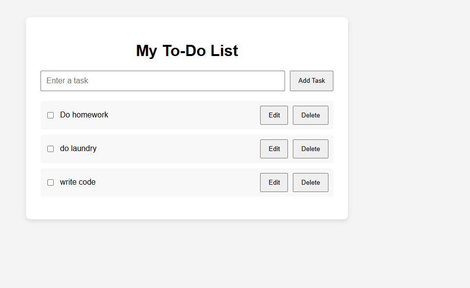

# JavaScript To-Do List

A simple to-do list application built with HTML, CSS, and JavaScript.

## Features

- Add new tasks
- Edit existing tasks
- Delete tasks
- Mark tasks as completed
- Save tasks using localStorage
- Tasks remain after refreshing the page

## Technologies Used

- HTML
- CSS
- JavaScript
- Browser localStorage

## What I Learned

While building this project, I practiced:

- JavaScript functions
- DOM manipulation
- Arrays and objects
- Event handling
- CRUD operations
- Using localStorage to store data
- Updating the user interface dynamically

## How to Use

1. Enter a task in the input field.
2. Click the Add button to create a task.
3. Edit a task when needed.
4. Delete tasks when they are no longer needed.
5. Refresh the page to see that saved tasks remain.

## Screenshot

## Live Demo

[View the Live To-Do List](https://sivanathilak.github.io/todo-list/)
